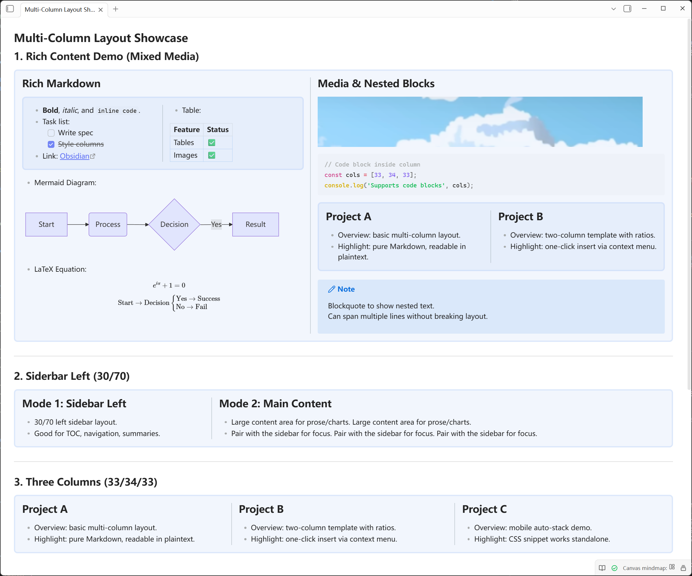
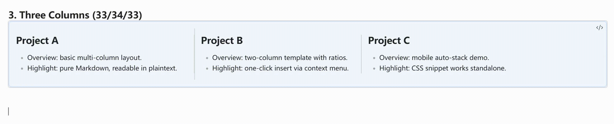
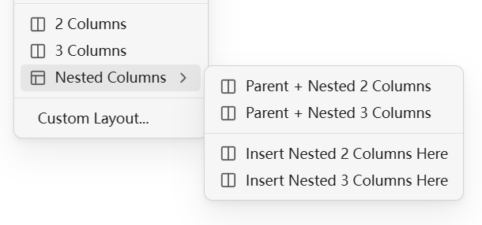

# Multi-Column Layout | [English](./README.md)

[](LICENSE)
[](https://obsidian.md)

✅ **杂志级排版样式 | 无需记忆语法 | 实时预览支持**  
✅ **多栏布局 | 快速插入模板 | 自定义宽度比例**  
✅ **Obsidian v1.5.0+ | Windows / macOS / Linux**

Multi-Column Layout 是一款 Obsidian 插件，旨在通过简单的 Callout 语法实现优雅的并排内容排版。通过右键菜单，您可以瞬间插入预设的多栏布局。

<p align="center">
  
  <br>
  <a href="Presentation/demo.md">点击查看如何利用本插件的语法生成上方的样式</a>
</p>

<p align="center">
  
</p>

## ✨ 功能特性

| 功能 | 描述 |
| :--- | :--- |
| **🚀 快速插入** | 右键菜单一键插入 2列、3列、侧边栏及**嵌套布局**。 |
| **🎨 外观样式** | 在设置中自定义背景颜色、边框宽度及圆角风格。 |
| **🧱 独立分栏外观** | 可在设置中将带边框的分栏渲染为彼此独立的卡片，而不是连续的一整块。 |
| **🧩 嵌套布局** | 支持在分栏内部再次分栏，构建复杂网格。 |
| **📐 自定义宽度** | 使用元数据（如 `[!col|40]`）轻松调整每一栏的宽度比例。 |
| **🖱️ 拖拽调宽** | 在 Live Preview 中拖拽分割线调整列宽，并自动回写到 `[!col|..]`。 |
| **📺 实时预览** | 支持 Live Preview，在输入时即可看到排版效果。 |
| **✍️ 列内编辑增强** | Live Preview 下默认启用“空行回车按 Markdown 方式退出”；也可在设置中关闭该选项，保持严格的 `>>/>>>>` 列内自动补前缀行为。 |
| **🔗 兼容性强** | 基于标准 Markdown/Callout 语法，即使不安装插件内容依然可读。 |

## 📥 安装方法

### 方法一：使用 BRAT 插件（推荐）
这是目前最方便的安装方式，可以自动保持插件更新。
1. 在 Obsidian 社区插件中安装 **BRAT**。
2. 打开 BRAT 设置，点击 **Add Beta plugin**。
3. 输入本仓库地址：`https://github.com/MaxMiksa/Obsidian-MultiColumn-Layout`
4. 点击 **Add Plugin** 即可。

### 方法二：手动安装
1. 前往 [Releases](../../releases) 页面下载最新的 `main.js`, `manifest.json`, `styles.css`。
2. 将文件放入您的库目录 `.obsidian/plugins/multi-column-layout/` 文件夹中。
3. 重启 Obsidian 并启用插件。

### 方法三：官方社区插件市场
插件已提交审核，预计 **2026年1月底** 上架。届时您可以在社区插件市场直接搜索 "Multi-Column Layout" 安装。

## 🚀 使用指南



1. 在编辑器中 **点击右键**。
2. 选择 **Insert Multi-Column**。
3. 选择您需要的布局模板（如 2 Columns, Nested Columns）。
4. 在生成的代码块中开始编写内容！

## 📝 语法指南

如果您喜欢手动编写，本插件的语法非常直观易懂：

- **容器**：使用 `> [!multi-column]` 创建外层容器。
- **分栏**：在容器内使用 `>> [!col]` 创建分栏。
- **调整宽度**：在 `col` 后添加管道符和数字即可，例如 `>> [!col|30]` 代表占 30% 宽度。
- **嵌套布局**：在分栏 `>> [!col]` 内部，可以使用更深层级的 `>>> [!multi-column]` 来创建子分栏。

**基础示例：**

```markdown
> [!multi-column]
>
>> [!col|30]
>> 左侧侧边栏内容...
>
>> [!col|70]
>> 右侧主要内容区域...
```

**嵌套示例：**

```markdown
> [!multi-column]
>
>> [!col]
>> 左侧栏
>
>> [!col]
>> 右侧栏
>>
>>> [!multi-column]
>>>
>>>> [!col]
>>>> 嵌套栏 A
>>>
>>>> [!col]
>>>> 嵌套栏 B
```

---

<details>
<summary><b>🛠️ 要求与技术细节</b></summary>

- 需要 Obsidian v1.5.0 或更高版本。
- 使用 CSS Flexbox 进行渲染。
- 语法结构：使用 `> [!multi-column]` 作为容器，`>> [!col]` 作为子栏。
- 嵌套布局使用更深层级的嵌套：`>> [!col]` 内包含 `>>> [!multi-column]`。
</details>

<details>
<summary><b>💻 开发者指南</b></summary>

1. 克隆此仓库。
2. 运行 `npm install`。
3. 运行 `npm run dev`（监听构建）或 `npm run build`。
4. 将 `main.js`, `manifest.json`, 和 `styles.css` 复制到你库的插件文件夹中。
</details>

## 🤝 贡献与联系

欢迎提交 Issue 和 Pull Request！  
如有任何问题或建议，请联系 Zheyuan (Max) Kong (卡内基梅隆大学，宾夕法尼亚州)。

Zheyuan (Max) Kong: kongzheyuan@outlook.com | zheyuank@andrew.cmu.edu
