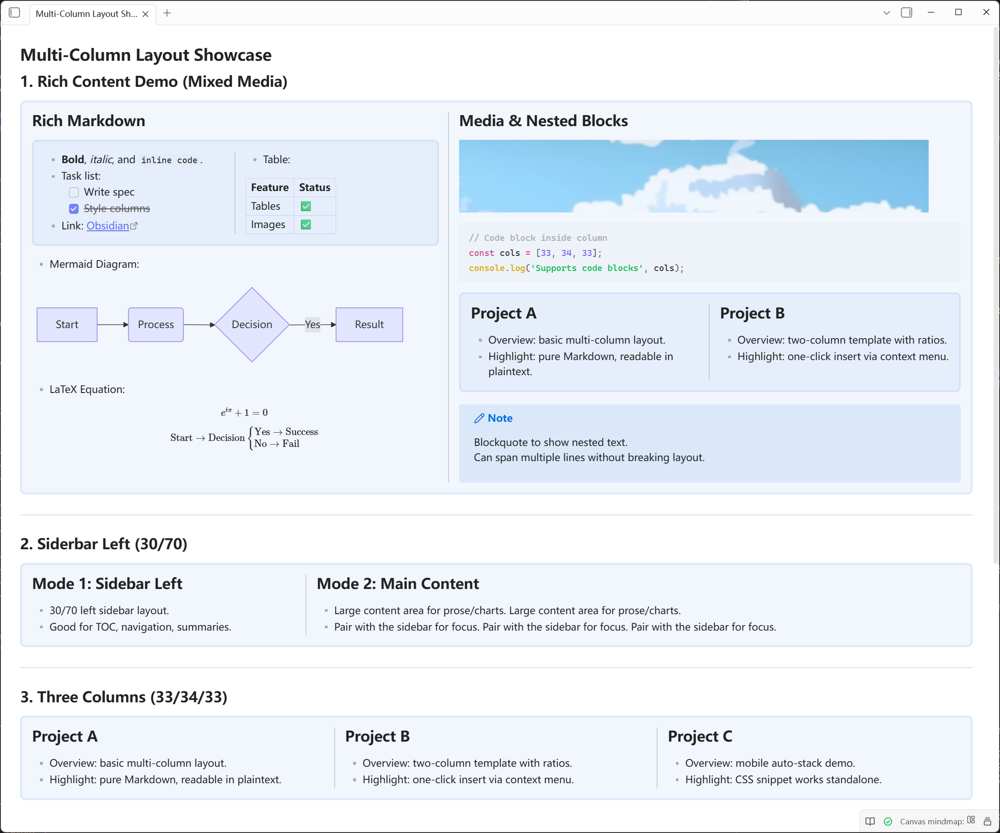

# Multi-Column Layout | [中文版](./README-zh.md)

[](LICENSE)
[](https://obsidian.md)

✅ **Magazine-style Layout | No Syntax to Memorize | Live Preview Support**  
✅ **Multi-Column Layout | Quick Insert Templates | Custom Width Ratios**  
✅ **Obsidian v1.5.0+ | Windows / macOS / Linux**  

Multi-Column Layout is an Obsidian plugin that simplifies the creation of side-by-side content using the built-in Callout syntax. It provides a convenient context menu to insert layouts instantly.

<p align="center">
  
  <br>
  <a href="Presentation/demo.md">Click to view how to generate the style above using this plugin's syntax</a>
</p>

## ✨ Features

| Feature | Description |
| :--- | :--- |
| **🚀 Quick Insert** | Right-click menu for 2-col, 3-col, Sidebar, and **Nested** layouts. |
| **🎨 Visual Styling** | Customize background colors, borders, and corner radius in settings. |
| **🧩 Nested Layouts** | Create complex grids by nesting columns inside columns. |
| **📐 Custom Widths** | Adjust column widths easily using metadata like `[!col|40]`. |
| **📺 Live Preview** | See your layouts rendered instantly as you type. |
| **✍️ In-Column Editing** | In Live Preview, Enter and multi-line paste keep content inside the current column automatically (`>>/>>>>`). |
| **🔗 Compatibility** | Uses standard Markdown/Callout syntax for maximum portability. |

## 🚀 Usage Guide

1. **Right-click** anywhere in your editor.
2. Navigate to **Insert Multi-Column**.
3. Select your desired layout (e.g., 2 Columns, Nested Columns).
4. Start typing your content inside the generated blocks!

## 📝 Syntax Guide

The syntax is designed to be simple and intuitive if you prefer typing it manually:

- **Container**: Use `> [!multi-column]` to create the wrapper.
- **Column**: Use `>> [!col]` nested inside to create columns.
- **Widths**: Add a pipe and number to define width percentage, e.g., `>> [!col|30]`.
- **Nested Columns**: Inside a `>> [!col]`, use deeper `>>> [!multi-column]` blocks to create sub-columns.

**Basic Example:**

```markdown
> [!multi-column]
>
>> [!col|30]
>> Left sidebar content...
>
>> [!col|70]
>> Main content area...
```

**Nested Example:**

```markdown
> [!multi-column]
>
>> [!col]
>> Left Column
>
>> [!col]
>> Right Column
>>
>>> [!multi-column]
>>>
>>>> [!col]
>>>> Nested Column A
>>>
>>>> [!col]
>>>> Nested Column B
```

---

<details>
<summary><b>🛠️ Requirements & Technical Details</b></summary>

- Requires Obsidian v1.5.0 or higher.
- Uses CSS Flexbox for rendering.
- Syntax: `> [!multi-column]` as container, `>> [!col]` as columns.
- Nested Layouts use deeper nesting: `>>> [!multi-column]` inside `>> [!col]`.
</details>

<details>
<summary><b>💻 Developer Guide</b></summary>

1. Clone this repo.
2. Run `npm install`.
3. Run `npm run dev` (watch) or `npm run build`.
4. Copy `main.js`, `manifest.json`, and `styles.css` to your vault's plugin folder.
</details>

## 🤝 Contribution & Contact

Welcome to submit Issues and Pull Requests!
Any questions or suggestions? Please contact Zheyuan (Max) Kong (Carnegie Mellon University, Pittsburgh, PA).

Zheyuan (Max) Kong: kongzheyuan@outlook.com | zheyuank@andrew.cmu.edu
